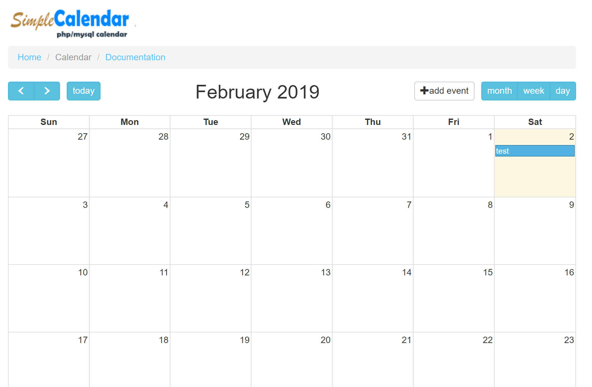

# Simple Calendar

## Warning

This is might have an outdate version of CodeIgniter. Good for starters.



## ABOUT

Simple Calendar is a customizable php/mysql calendar that utilizes CodeIgniter framework and Arshaw's Fullcalendar plugin.

## INSTALLATION

To install iCoolCal, follow the following steps:

Copy the files into the root of your existing CodeIgniter installation. Make sure you don't have existing files with similar names.

```txt
/application/controllers
/application/models
/application/views
/assets
Edit the following files
/application/config/config.php
/application/config/routes.php
/application/config/database.php
install database with schema in the root folder (sql_calendar.sql)
```
